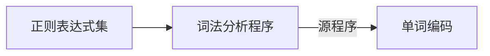

# 项目一

## 要求：

1. 以**文本文件**的方式输入某一高级程序设计语言的**所有单词**对应的**正则表达式**，系统需要提供一个操作界面，让用户打开某一语言的所有单词对应正则表达式文本文件，该文本文件的具体格式可根据自己实际的需要进行定义；
2. 需要提供窗口以便用户可以查看转换得到的**NFA**(可用状态转换表呈现);
3. 需要提供窗口以便用户可以查看转换得到的**DFA**(可用状态转换表呈现);
4. 需要提供窗口以便用户可以查看转换得到的**最小化DFA**(可用状态转换表呈现)》;
5. 需要提供窗口以便用户可以查看转换得到的**词法分析程序**（该分析程序需要用**C语言**描述)【只能使用讲稿中的方法一或方法二来生成词法分析程序];
6. 对要求（⑤）得到的源程序**进行编译生成一个可执行程序**，并以该高级程序设计语言的一个源程序进行测试，输出该源程序的单词编码。需要提供窗口以便用户可以查看该单词编码;
7. 对系统进行测试： 
    -   先以TINY语言的所有单词的正则表达式作为文本来测试，生成一个TINY语言的词法分析源程序；
    -   接着对这个词法分析源程序利用C/C+编译器进行编译，并生成可执行程序；
    -   以`sample.tny`来测试，输出该TINY语言源程序的单词编码文件`sample.1ex`;
8. 应用程序为Windows界面;
9. 书写完善的软件文档;

**主要思路**：


**界面**：
<div align = center>
    
</div>


## 实现

**正则**：

```c++
// 关键字
keyword = if|then|else|end|repeat|until|read|write

// 专用符号
symbol = +|-|*|/|%|<|<>|<=|>=|>|=|{|}|;|:=

//digit = 0|1|2|3|4|5|6|7|8|9
// number
number = digit digit*(.digit digit*)?
//letter = a|b|c|d|e|f|g|h|i|j|k|l|m|n|o|p|q|r|s|t|u|v|w|x|y|z|A|B|C|D|E|F|G|H|I|J|K|L|M|N|O|P|Q|R|S|T|U|V|W|X|Y|Z
// identifier
identifier = (_|letter)(_|letter|digit)*

// comment
comment = {}
```

`regex.txt`：
```txt
keyword=if|then|else|end|repeat|until|read|write
symbol=+|-|*|/|%|<|<>|<=|>=|>|=|{|}|;|:=
number=digitdigit*(.digitdigit*)?
identifier=(_|letter)(_|letter|digit)*
comment={}
exit
```

**转换**：
<div align = center>
    
</div>

